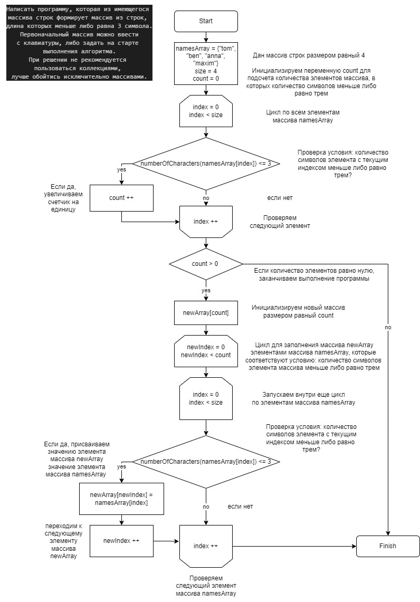

# VerificationWork
# Итоговая проверочная работа
## Описание
Проект содержит блок схему алгоритма и программу решения задачи, написанную на языке C#.
## Задача
Написать программу, которая из имеющегося массива строк формирует массив из строк, длина которых меньше либо равна 3 символа. Первоначальный массив можно ввести с клавиатуры, либо задать на старте выполнения алгоритма. При решении не рекомендуется пользоваться коллекциями, лучше обойтись исключительно массивами.
# Блок-схема

